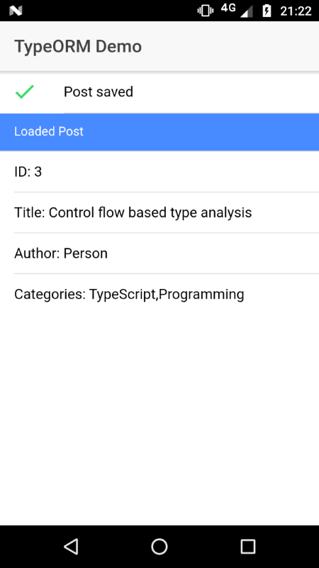

# Using TypeORM in an Ionic project
You can use TypeORM in connection with the `cordova-sqlite-storage` plugin in your Ionic app.
This project demonstrates how that would work.

## TypeORM >= 0.1.7
To support webpack builds outside of Ionic we had to remove the automatic selection of the correct TypeORM version (the `typeorm` package comes with a Node and a browser version). In order to keep using TypeORM with Ionic you have to create a custom `webpack.config.js` file. This example contains one that is identical to the one Ionic uses when no config file is specified but adds the `NormalModuleReplacementPlugin` to select the correct version.
If you already have a custom webpack config file you have to add these lines to your plugins (for both development and production):

```js
plugins: [
  ...,
  new webpack.NormalModuleReplacementPlugin(/typeorm$/, function (result) {
    result.request = result.request.replace(/typeorm/, "typeorm/browser");
  })
]
```
If you don't use a custom wepack config, copy the one from this example and add it to your `package.json` under `config`:
```json
"config": {
  "ionic_webpack": "./config/webpack.config.js"
}
``` 

## Installation

To run this example in production or development mode you have to make sure, `ionic` and `cordova` are installed globally on your machine. After that you can install all necessary dependencies for running this example.

0. Check if `npm` is installed. Otherwise please [install `node.js` and `npm`](https://nodejs.org/en/download/package-manager/).
```bash
npm -v
```

1. Install ionic and cordova command line interface globally.
```bash
npm install -g cordova ionic
```

2. Install all dependencies listed in [`package.json`](/package.json#L15-L47).
```bash
npm install
```

### Run app in development mode
3. Run the app in your browser:
```bash
ionic serve
```

### Run app in production mode
3. Add an iOS or Android platform to your project: 
```bash
ionic cordova platform add ios 
# or 
ionic cordova platform add android
```

4. Run the app on your device:
```bash
ionic cordova run ios
# or
ionic cordova run android
```

*For further information please read [ionic's deployment guide](https://ionicframework.com/docs/intro/deploying/).*




### Using TypeORM in your own app
1. Install the plugin: `ionic cordova plugin add cordova-sqlite-storage --save`

2. Install TypeORM: `npm install typeorm --save`

3. Install node.js-Types: `npm install @types/node --save-dev`

4. Add `"typeRoots": ["node_modules/@types"]` to your `tsconfig.json` under `compilerOptions`

5. Create a custom webpack config file like the one [included in this project](config/webpack.config.js) to use the correct TypeORM version and add the config file to your [`package.json`](package.json#L12-14) (Required with TypeORM >= 0.1.7)

### Limitations to TypeORM when using production builds

Since Ionic make a lot of optimizations while building for production, the following limitations will occur:

1. Entities have to be marked with the table name (eg `@Entity('table_name')`)

2. `getRepository()` has to be called with the name of the entity instead of the class (*eg `getRepository('post') as Repository<Post>`*)

3. Date fields are **not supported**:
```ts
@Column()
birthdate: Date;
```
